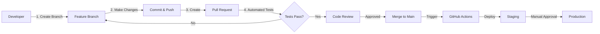

# GitOps Practices

This repository follows GitOps principles:

## 1. Declarative Configuration
- All configuration is declared in Git (YAML, JSON, etc.)
- No manual configuration changes
- Infrastructure and apps defined as code

## 2. Git as Single Source of Truth
- Git contains the desired state of the system
- All changes go through Git (PR workflow)
- History is preserved and auditable

## 3. Automated Deployment
- GitHub Actions automatically deploys on merge to main
- No manual deployment steps
- Consistent, repeatable deployments

## 4. Continuous Reconciliation
- System automatically syncs to Git state
- Drift detection and correction
- Self-healing infrastructure

## Workflow

## Branch Strategy

- `main` - Production-ready code, always deployable
- `feature/*` - New features
- `bugfix/*` - Bug fixes
- `hotfix/*` - Urgent production fixes

## Required Checks Before Merge

✅ All status checks pass
✅ Code review approved
✅ Conversations resolved
✅ Branch up to date with main

## Deployment Flow

1. **Commit to main** → Auto-deploy to staging
2. **Manual approval** → Deploy to production
3. **Tag creation** → Create GitHub release

## Security

- Branch protection on `main`
- Required reviews by code owners
- Signed commits (recommended)
- Secrets stored in GitHub Secrets
- Environment-specific secrets

## Monitoring

- GitHub Actions logs
- Deployment status badges
- Environment URLs

## Next Steps

- [ ] Add ArgoCD for Kubernetes deployments
- [ ] Implement FluxCD for continuous reconciliation
- [ ] Set up Talos Linux cluster
- [ ] Add monitoring and observability
